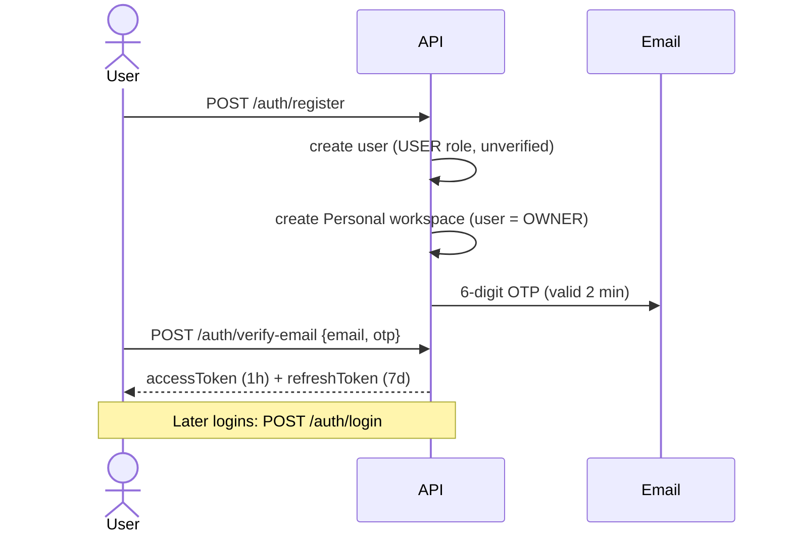
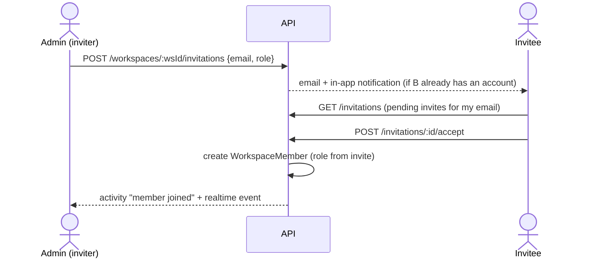
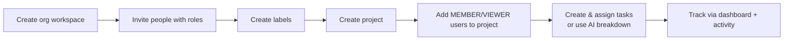
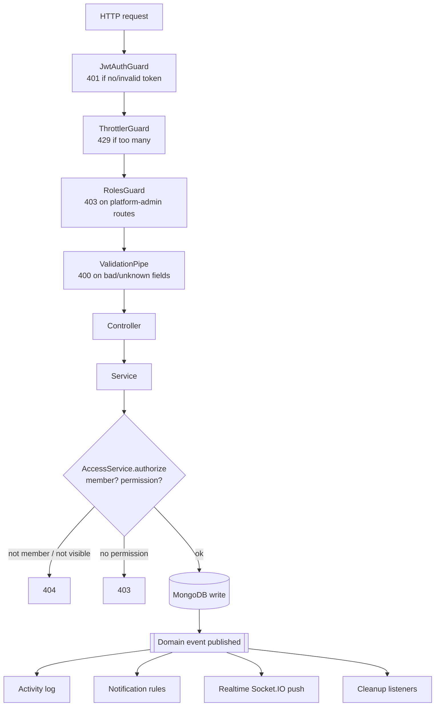

# Taskify Backend — Workflow Guide

How the NestJS backend works, told as user journeys: what a normal user, a workspace member, a workspace admin and a platform admin can do, and what happens behind each action.

For module layout and coding conventions, see [ARCHITECTURE.md](../ARCHITECTURE.md). This file is about **behaviour**.

---

## 1. The big picture in one minute

```text
User  (just an identity: name, email, password)
 │
 ├── Personal workspace ........ role OWNER   (auto-created at sign-up, only you)
 ├── "Acme Corp" workspace ..... role ADMIN   (you created it, or got promoted)
 └── "Client X" workspace ...... role MEMBER  (you accepted an invitation)
        │
        └── Projects
              └── Tasks ── Subtasks (1 level deep)
                    ├── Comments (+ 1 level of replies, @mentions)
                    ├── Attachments (files, max 20 MB)
                    ├── Dependencies ("A blocks B", no cycles)
                    └── Labels (workspace-wide tags)
```

Three ideas explain almost everything:

1. **A role belongs to a membership, not to a user.** The same person can be OWNER in one workspace and VIEWER in another. The role is stored on `WorkspaceMember`.
2. **There are two kinds of "admin".**
   - **Workspace ADMIN / OWNER**: manages one workspace (members, projects, settings).
   - **Platform ADMIN** (`User.role = ADMIN`): manages user accounts across the whole system. It gives **no** access to anyone's workspaces.
3. **Every request is checked in the service layer.** The chain is task → project → workspace → your membership → your role's permission. If you're not a member, you get **404**, so the backend never reveals that something exists. If you're a member without the permission, you get **403**.

---

## 2. Who is who

| Who | How they get there | Scope |
| --- | --- | --- |
| **Visitor** | Not logged in | Only public routes: register, login, OTP, password reset, health |
| **Normal user** | Registered + email verified | Their own profile, personal workspace, invitations sent to them, notifications |
| **Workspace member** (OWNER / ADMIN / MANAGER / MEMBER / VIEWER) | Created the workspace, or accepted an invite | What their role permits, **inside that workspace only** |
| **Platform admin** | `User.role = ADMIN` (set in the DB, no API grants it) | `/users` moderation endpoints (list, edit, activate, deactivate, delete users) |

---

## 3. Workspace roles and permissions

Roles stack: each one has everything the role below it has, plus more.

```text
VIEWER  →  MEMBER  →  MANAGER  →  ADMIN  →  OWNER
 read      + work on    + run        + manage    + delete the
 + comment   tasks       projects     people       workspace
```

| What you want to do | VIEWER | MEMBER | MANAGER | ADMIN | OWNER |
| --- | :-: | :-: | :-: | :-: | :-: |
| See workspace, member list, activity | ✅ | ✅ | ✅ | ✅ | ✅ |
| See projects | only ones you're added to | only ones you're added to | **all** | **all** | **all** |
| Read tasks, comments, attachments | ✅ | ✅ | ✅ | ✅ | ✅ |
| Write comments | ✅ | ✅ | ✅ | ✅ | ✅ |
| Create / update / assign tasks | ❌ | ✅ | ✅ | ✅ | ✅ |
| Upload attachments | ❌ | ✅ | ✅ | ✅ | ✅ |
| Use AI task breakdown | ❌ | ✅ | ✅ | ✅ | ✅ |
| Delete tasks | ❌ | ❌ | ✅ | ✅ | ✅ |
| Create / edit projects, add project members | ❌ | ❌ | ✅ | ✅ | ✅ |
| Create / edit / delete labels | ❌ | ❌ | ✅ | ✅ | ✅ |
| Edit/delete **other people's** comments & files | ❌ | ❌ | ✅ | ✅ | ✅ |
| Delete projects | ❌ | ❌ | ❌ | ✅ | ✅ |
| Edit workspace name/description | ❌ | ❌ | ❌ | ✅ | ✅ |
| Invite, change role, suspend, remove members | ❌ | ❌ | ❌ | ✅ | ✅ |
| Delete the workspace | ❌ | ❌ | ❌ | ❌ | ✅ |

Source of truth: [src/common/authorization/permissions.ts](../src/common/authorization/permissions.ts).

**Three extra rules on top of the table:**

- **Rank rule.** You can only manage people ranked **below** you, and only grant roles **below** your own. ADMIN can make someone MANAGER but not ADMIN. OWNER can make someone ADMIN. Nobody can grant OWNER.
- **Ownership override.** You can always edit/delete **your own** comments and delete **your own** attachments, whatever your role.
- **Project visibility.** VIEWER and MEMBER only see projects where a `ProjectMember` row exists for them. The project creator is always added automatically.

---

## 4. Journey: normal user (no team yet)

### 4.1 Sign-up → verify → login



| Step | Endpoint | Notes |
| --- | --- | --- |
| Register | `POST /auth/register` | Email + username must be unique. A personal workspace is created right away. |
| Verify email | `POST /auth/verify-email` | OTP expires in **2 minutes**. Returns tokens, so the user is logged in. |
| Resend OTP | `POST /auth/resend-otp` | |
| Login | `POST /auth/login` | Blocked with 403 until email is verified. |
| Refresh | `POST /auth/refresh` | **Rotation:** the old refresh token is used up and a new pair is issued. |
| Logout | `POST /auth/logout` | Revokes that refresh token. |
| Forgot / reset password | `POST /auth/forgot-password`, `POST /auth/reset-password` | Reset OTP valid **5 minutes**. |
| Change password | `POST /auth/change-password` | Needs current password. |
| Update profile | `PUT /auth/profile` | avatar, dob, gender, bio, phone |
| Avatar upload | `POST /users/me/avatar` | |
| Delete own account | `DELETE /auth/account` | Soft delete + all refresh tokens cleared. |

Credential endpoints (register, login, forgot/reset password) are limited to **10 requests/min per IP**. Everything else is 120/min.

### 4.2 Working alone in the personal workspace

A normal user is **OWNER** of their personal workspace, so they have every permission there:

```text
GET  /workspaces                          → personal workspace is listed first
POST /workspaces/:wsId/projects           → create a project
POST /projects/:projectId/tasks           → create tasks / subtasks
PATCH /tasks/:taskId                      → move status, set due date, labels…
GET  /users/me/tasks                      → "My Tasks" across all workspaces
GET  /workspaces/:wsId/dashboard          → stats
```

Personal workspace limits: **no invitations, no other members, cannot be deleted.**

### 4.3 Starting a team

```text
POST /workspaces  { name, description }   → new ORGANIZATION workspace, caller = OWNER
```

From here, the user is an OWNER and follows section 6.

---

## 5. Journey: workspace member (joined by invitation)

### 5.1 Getting in



- Invitations are matched by **email**. The invitee must register/log in with that same email to see it.
- They expire after **7 days**. Only one pending invite per email per workspace.
- `POST /invitations/:id/decline` rejects it. Accepting twice is safe (second call gets 409).

### 5.2 Daily work as a MEMBER

```text
GET   /workspaces                         → all my workspaces, with my role + permissions[]
GET   /workspaces/:wsId/projects          → only projects I've been added to
GET   /projects/:projectId/tasks          → filter: status, priority, assigneeId=me|none, labelId, due range, search
POST  /projects/:projectId/tasks          → create task (or subtask via parentTaskId)
PATCH /tasks/:taskId                      → update / assign / move on board
POST  /tasks/:taskId/comments             → comment, @username mentions, replies
POST  /tasks/:taskId/attachments          → upload file (≤ 20 MB)
POST  /tasks/:taskId/dependencies         → "this task is blocked by …"
GET   /users/me/tasks                     → everything assigned to me
GET   /notifications                      → my inbox
GET   /search?q=…                         → only things I can see
```

The `permissions[]` array returned by `GET /workspaces` is what the frontend should use to show or hide buttons. Don't hard-code role names in the UI.

**Task rules worth knowing:**

- Status flow: `TODO → IN_PROGRESS → IN_REVIEW → BLOCKED → DONE` (any order is allowed). Moving to `DONE` sets `completedAt`. Moving back clears it.
- Subtasks are **one level only**. A subtask can't have subtasks.
- Assignee must be a workspace member who can see that project.
- `dueDate` must be on or after `startDate`.
- Deleting a task (MANAGER+) also soft-deletes its subtasks.

### 5.3 VIEWER

Read-only plus comments. Useful for clients or stakeholders.

### 5.4 Leaving

```text
DELETE /workspaces/:wsId/members/:myUserId     → leave the workspace
DELETE /projects/:projectId/members/:myUserId  → leave one project
```

When someone leaves or is removed from a workspace, the backend automatically:

1. removes them from all projects in that workspace,
2. **unassigns their open tasks** (they go back to the pool),
3. disconnects their live sockets so they lose realtime access right away,
4. hides that workspace's tasks from their "My Tasks".

---

## 6. Journey: workspace ADMIN / OWNER

### 6.1 Managing people

| Action | Endpoint | Who |
| --- | --- | --- |
| Invite | `POST /workspaces/:wsId/invitations` `{email, role}` | ADMIN+ (role must be below yours) |
| See invitations | `GET /workspaces/:wsId/invitations?status=PENDING` | ADMIN+ |
| Cancel invite | `DELETE /workspaces/:wsId/invitations/:id` | ADMIN+ |
| List members | `GET /workspaces/:wsId/members?role=&search=` | everyone |
| Change role / title / suspend | `PATCH /workspaces/:wsId/members/:userId` `{role?, title?, status?}` | ADMIN+ (target must rank below you) |
| Remove member | `DELETE /workspaces/:wsId/members/:userId` | ADMIN+ |

- `title` (e.g. "Senior Developer") is just a label for the UI. It has no effect on permissions.
- `status: SUSPENDED` keeps the membership row but blocks all access, the same as not being a member.
- You can't change your own membership. The OWNER can't leave their own workspace.

### 6.2 Managing projects

```text
POST   /workspaces/:wsId/projects          MANAGER+   (creator auto-added as project member)
PATCH  /projects/:projectId                MANAGER+   (status: ACTIVE / ON_HOLD / COMPLETED / ARCHIVED / CANCELLED)
DELETE /projects/:projectId                ADMIN+     (soft delete; its tasks become unreachable)
POST   /projects/:projectId/members        MANAGER+   { userId }  must already be a workspace member
DELETE /projects/:projectId/members/:uid   MANAGER+
```

Typical setup flow for a new team:



MANAGER+ see every project automatically, so you only need to add VIEWERs and MEMBERs to projects.

### 6.3 Workspace settings

```text
PATCH  /workspaces/:wsId     ADMIN+   name, description, avatar
DELETE /workspaces/:wsId     OWNER    soft delete; everything inside becomes unreachable
```

### 6.4 Oversight

```text
GET /workspaces/:wsId/dashboard   → totals, overdue, due today, by status, by priority, per-project progress, per-person workload
GET /workspaces/:wsId/activity    → who did what (e.g. "status TODO → IN_PROGRESS")
GET /projects/:projectId/activity
GET /tasks/:taskId/activity
```

Dashboard and activity only include projects **the caller** can see.

---

## 7. Journey: platform admin

Separate from workspaces. Guarded by `RolesGuard` with `@Roles(ADMIN)`, using the `roles` claim in the JWT.

| Endpoint | Does |
| --- | --- |
| `GET /users` | List all users |
| `PUT /users/:id` | Edit a user |
| `PATCH /users/:id/activate` / `deactivate` | Toggle `isActive` |
| `PATCH /users/:id/delete` | Soft-delete a user |

A platform admin does **not** automatically see any workspace. To look inside one, they need to be invited like anyone else.

There is no API to make someone a platform admin. It's set directly in the database.

---

## 8. What happens behind every write



Services never call notifications, activity or sockets directly. They publish one event, like `task.updated`, and the listeners react on their own. Listener failures are logged and never break the request.

### Who gets notified

| Event | Who gets an in-app notification |
| --- | --- |
| Task created with an assignee / assignee changed | The new assignee |
| Task status changed | Task creator + assignee |
| Comment added | Task creator + assignee (except the author) |
| `@username` in a comment | The mentioned user (only if they can see the project) |
| Added to a project | That user |
| Invited to a workspace | The invitee (in-app if they have an account) + **email** |
| Task due within 24h | The assignee (cron every 30 min, sent once per task) |

Notification endpoints: `GET /notifications`, `GET /notifications/unread-count`, `PATCH /notifications/:id/read`, `PATCH /notifications/read-all`.

### Realtime (Socket.IO)

1. Connect with the access token. You auto-join your personal `user` room, which receives `notification` events.
2. Emit `subscribe { projectId }` or `subscribe { workspaceId }`. The server checks access first.
3. You then receive `event` messages (task/comment/project changes) for that room. Re-fetch the entity by id.

---

## 9. Other features at a glance

| Feature | Endpoints | Notes |
| --- | --- | --- |
| Labels | `GET/POST /workspaces/:wsId/labels`, `PATCH/DELETE /labels/:id` | Unique name per workspace (case-insensitive). Deleting removes it from all tasks. |
| Dependencies | `GET/POST /tasks/:taskId/dependencies`, `DELETE …/:depId` | Same project only, no self-link, **no cycles**. |
| Attachments | `GET/POST /tasks/:taskId/attachments`, `GET /attachments/:id/download`, `DELETE /attachments/:id` | Stored on local disk; max 20 MB. |
| AI breakdown | `POST /projects/:projectId/ai/task-breakdown` (suggest), `…/apply` (create) | Suggest is read-only. Apply goes through the normal task service, so all rules apply. Needs `task:create`. |
| Search | `GET /search?q=` | Tasks, projects, comments, and people who share a workspace with you. |
| Health | `GET /health`, `/health/live`, `/health/ready`, … | Public. |
| API docs | `GET /api` | Swagger UI. |

---

## 10. Status codes cheat-sheet

| Code | Meaning in Taskify |
| --- | --- |
| 400 | Validation failed, or a business rule broke (bad date range, nested subtask, cycle, personal-workspace limit) |
| 401 | No/expired access token, or a refresh token was used as an access token |
| 403 | You're a member but your role lacks the permission, or the rank rule blocks you, or the email isn't verified |
| 404 | Doesn't exist **or you're not allowed to know it exists** |
| 409 | Duplicate (already a member, pending invite exists, label name taken, invite already answered) |
| 410 | Invitation expired, or its workspace was deleted |
| 429 | Rate limit |

---

## 11. Gaps found while reading the code (to decide before we proceed)

These aren't bugs in what exists. They're missing pieces or loose ends:

1. **No ownership transfer.** The owner can't leave ("Transfer ownership or delete it instead"), but there's no endpoint to transfer ownership. Nobody can grant OWNER.
2. **Deactivated users can still log in.** `login` checks `isEmailVerified` but not `isActive`, so the platform-admin "deactivate" has no real effect on access. Also, `PUT /auth/profile` lets a user set their own `isActive`.
3. **Access tokens stay valid after account delete/deactivate.** The JWT guard doesn't look up the user, so an already-issued access token keeps working for up to 1h.
4. **Attachments use local disk.** They'll be lost on hosts with an ephemeral filesystem (e.g. Render). An S3-compatible `StorageService` is needed for production.
5. **Realtime is single-instance.** Running several API instances needs the Socket.IO Redis adapter.
6. **No restore for soft-deleted items.** Workspaces, projects and tasks are recoverable in the DB, but there's no API for it.
7. **MEMBERs can edit any task** in projects they can see, not only tasks assigned to them. That may be intended, but confirm it with product.
